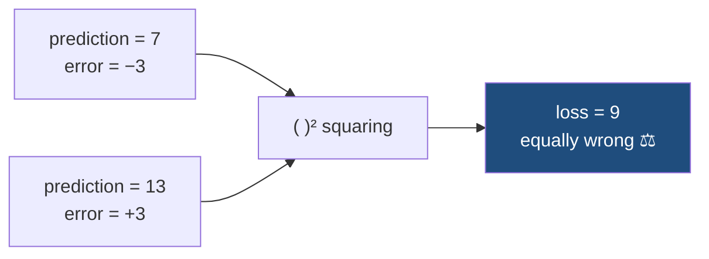
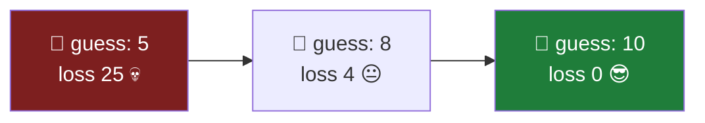

<div align="center">

[](https://git.io/typing-svg)


</div>

---

> **The rule of this lab:** one snippet = one idea.
> No giant training program. No NumPy. Just run it, change a number, run it again. 🧪

<div align="center">

| # | Experiment | What it teaches |
|:---:|---|---|
| 1️⃣ | [Change the prediction](#1️⃣-see-how-different-predictions-change-the-loss) | Farther from the target → bigger loss |
| 2️⃣ | [Compare several predictions](#2️⃣-compare-several-predictions) | Loss lets you *rank* answers |
| 3️⃣ | [Why we square the error](#3️⃣-why-negative-errors-arent-a-problem-after-squaring) | `-3` and `+3` are equally wrong |
| 4️⃣ | [A tiny "AI" improving](#4️⃣-a-tiny-ai-trying-to-improve) | Learning = making the loss shrink |

</div>

---

## 1️⃣ See how different predictions change the loss

```python
target = 10

prediction = 8
error = prediction - target
loss = error ** 2

print("Prediction:", prediction)
print("Loss:", loss)
```

Now go back and change one line:

```python
prediction = 5
```

```text
Prediction: 5
Loss: 25
```

<details>
<summary>🎛️ <b>Play with it</b> — try these values</summary>

| `prediction` | `error` | `loss` |
|:---:|:---:|:---:|
| 10 | 0 | **0** 🎯 |
| 9 | −1 | **1** 😊 |
| 8 | −2 | **4** 🙂 |
| 5 | −5 | **25** 😬 |
| 1 | −9 | **81** 💀 |

</details>

> 🧠 **Use case:** understanding that a prediction farther from the target gets a larger loss.

---

## 2️⃣ Compare several predictions

```python
target = 10

prediction1 = 9
prediction2 = 7
prediction3 = 3

loss1 = (prediction1 - target) ** 2
loss2 = (prediction2 - target) ** 2
loss3 = (prediction3 - target) ** 2

print(loss1)
print(loss2)
print(loss3)
```

```text
1
9
49
```

<div align="center">

```text
9  →   1 loss   😊   ▓
7  →   9 loss   😐   ▓▓▓▓▓
3  →  49 loss   💀   ▓▓▓▓▓▓▓▓▓▓▓▓▓▓▓▓▓▓▓▓▓▓▓▓
```

</div>

> 🧠 **Use case:** seeing why the AI can use loss to tell which predictions are better or worse.

---

## 3️⃣ Why negative errors aren't a problem after squaring

**Undershooting:**

```python
target = 10

prediction = 7
error = prediction - target
loss = error ** 2

print("Error:", error)
print("Loss:", loss)
```

```text
Error: -3
Loss: 9
```

**Overshooting:**

```python
prediction = 13
error = prediction - target
loss = error ** 2

print("Error:", error)
print("Loss:", loss)
```

```text
Error: 3
Loss: 9
```



Both are **3 away** from the target, so both get the **same loss**.

> 🧠 **Use case:** understanding why we don't want the `−` and `+` errors to cancel each other out.

---

## 4️⃣ A tiny "AI" trying to improve

This one shows *learning* — without any scary math yet.

```python
target = 10

prediction = 5
loss = (prediction - target) ** 2

print("Before:")
print("Prediction:", prediction)
print("Loss:", loss)

prediction = 8
loss = (prediction - target) ** 2

print("\nAfter:")
print("Prediction:", prediction)
print("Loss:", loss)
```

```text
Before:
Prediction: 5
Loss: 25

After:
Prediction: 8
Loss: 4
```

<div align="center">

```text
PREDICTION:   5   →   8   →   🎯 10
LOSS:        25   →   4   →   0
                  ↓
        loss is getting smaller 😎
```

</div>



> 🧠 **The big idea of Class 2:** the AI's goal is to keep adjusting itself so that **the loss gets smaller.**

---

<div align="center">

## ❓ The Question We Haven't Answered Yet

In experiment 4, **we** typed `prediction = 8`. The AI didn't choose it.

> ### *"Okay... but HOW does it know whether to increase or decrease the weight?"*

That's exactly where **slope** and **derivatives** come in. ⛰️📐

[](#)

</div>

---

<div align="center">

### 🎯 Lab Recap

`loss = (prediction − target)²` · bigger distance → bigger loss · squaring kills the sign · **learning = shrinking the loss**

</div>
