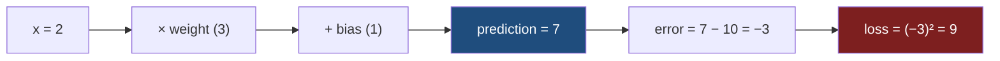
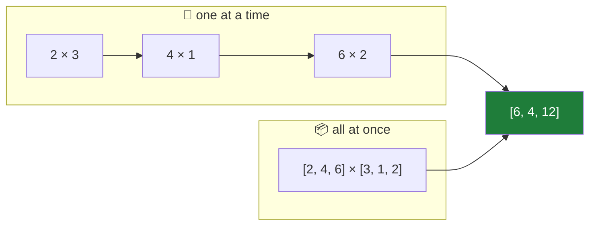

<div align="center">

[](https://git.io/typing-svg)


</div>

---

<div align="center">

```text
        🐍                          📦
   PURE PYTHON                    NUMPY
   "I do it myself"          "I do it in bulk"
        |                            |
        +------------ ⚔️ ------------+
                      |
              SAME EXACT MATH
```

</div>

---

# 🥊 The Setup

Same numbers for both fighters. No tricks.

<div align="center">

| `x` | `weight` | `bias` | `target` |
|:---:|:---:|:---:|:---:|
| 2 | 3 | 1 | 10 |

</div>



---

# 🐍 Corner 1 — Without a Library

<details open>
<summary><b>▶️ pure_python.py</b></summary>

```python
# Input
x = 2

# Weight and bias
weight = 3
bias = 1

# Correct answer
target = 10

# Prediction
prediction = weight * x + bias

# Error
error = prediction - target

# Loss
loss = error ** 2

print("Prediction:", prediction)
print("Error:", error)
print("Loss:", loss)
```

</details>

```text
Prediction: 7
Error: -3
Loss: 9
```

---

# 📦 Corner 2 — With NumPy

<details open>
<summary><b>▶️ with_numpy.py</b></summary>

```python
import numpy as np

# Input
x = 2

# Weight and bias
weight = 3
bias = 1

# Correct answer
target = 10

# Prediction
prediction = weight * x + bias

# Error
error = prediction - target

# Loss
loss = np.square(error)

print("Prediction:", prediction)
print("Error:", error)
print("Loss:", loss)
```

</details>

```text
Prediction: 7
Error: -3
Loss: 9
```

---

# 🤔 So What's Actually Different?

<div align="center">

### Almost nothing. 😭

</div>

| Step | 🐍 Pure Python | 📦 NumPy | Same? |
|---|---|---|:---:|
| Prediction | `weight * x + bias` | `weight * x + bias` | ✅ |
| Error | `prediction - target` | `prediction - target` | ✅ |
| **Loss** | `error ** 2` | `np.square(error)` | ⚠️ *different spelling* |
| Result | `9` | `9` | ✅ |

<div align="center">

```text
      error ** 2                np.square(error)
           \                          /
            \                        /
             +--------→  (-3)² = 9  ←+
                     identical
```

</div>

> 🧠 One line changed. The math didn't.

---

# 🚀 Where NumPy Actually Earns Its Keep

The moment you stop having **one** number and start having **many**:

```python
x = [2, 4, 6]
weights = [3, 1, 2]
```

<table>
<tr>
<th>🐍 Pure Python — manual labor</th>
<th>📦 NumPy — one line</th>
</tr>
<tr>
<td>

```python
result = []
for i in range(len(x)):
    result.append(x[i] * weights[i])

print(result)
```

</td>
<td>

```python
import numpy as np

x = np.array([2, 4, 6])
weights = np.array([3, 1, 2])

result = x * weights

print(result)
```

</td>
</tr>
<tr>
<td align="center"><code>[6, 4, 12]</code></td>
<td align="center"><code>[ 6  4 12]</code></td>
</tr>
</table>



<div align="center">

```text
3 numbers      → loops are fine        🙂
300 numbers    → loops are annoying    😐
3,000,000      → loops are 💀          NumPy 📦
```

</div>

---

<div align="center">

# 🏆 The Verdict

</div>

> ### **Libraries don't change the math.**
> ### They give us tools to perform the math more easily — especially when the amount of data gets bigger.

<div align="center">

```text
   🐍 shows you WHAT is happening
   📦 saves you time WHILE it happens
   
   Learn with 🐍.  Ship with 📦.
```

-success?style=for-the-badge)

</div>

---

<div align="center">

### 🎯 One-Line Recap

`error ** 2` and `np.square(error)` are twins — NumPy just scales to a million of them without breaking a sweat.

</div>
