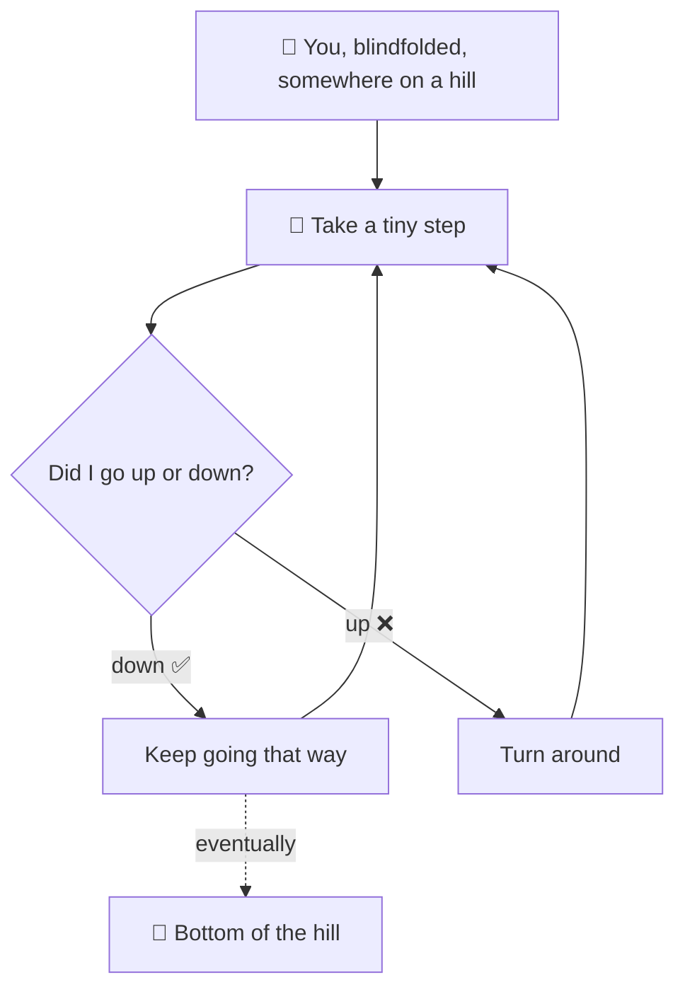
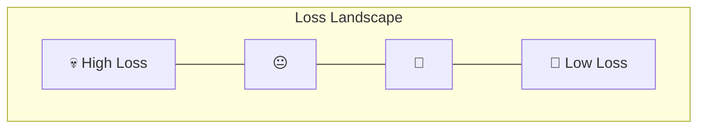
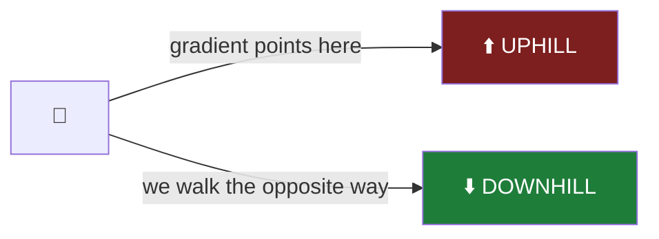
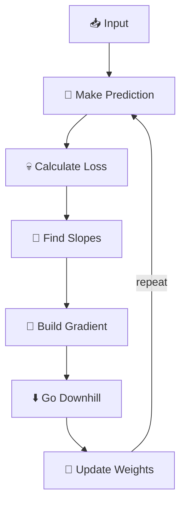
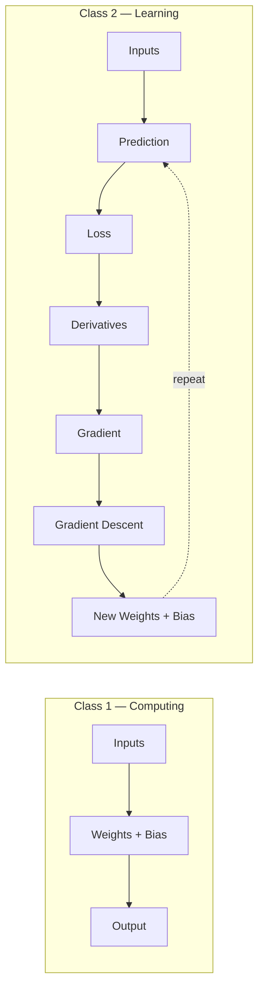
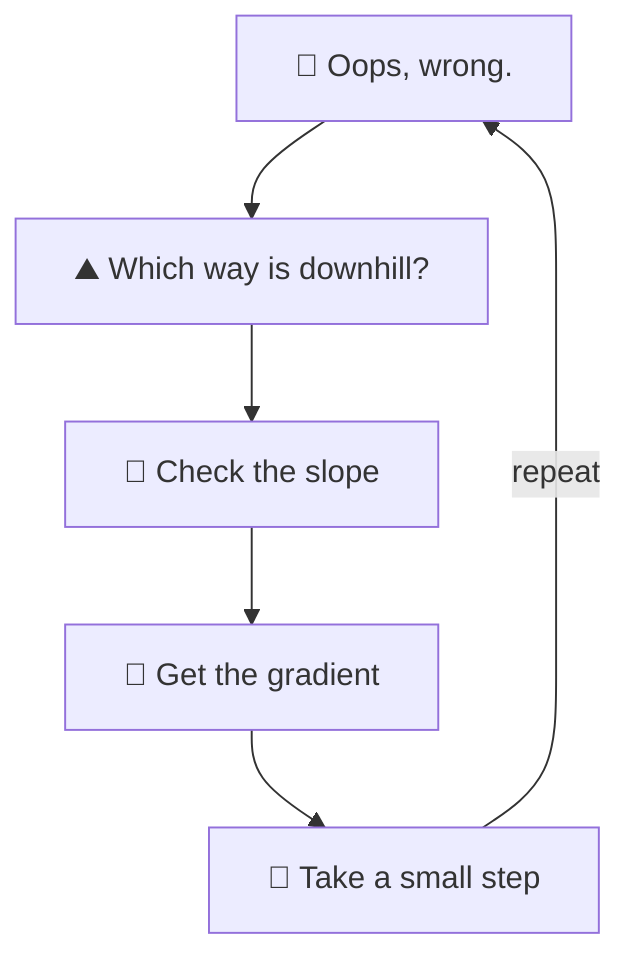

<div align="center">

[](https://git.io/typing-svg)


</div>

---

> *"Last class we manually picked the weights. Cute. But what happens when we have 10 million of them?"* 💀

Welcome back.

In [**Class 1**](#) we built a neuron. It could look at some inputs, multiply them by weights, add a bias, and spit out a number. Very impressive.

Except there was one tiny problem — **we** chose the weights:

```python
weights = [0.5, 200, -10]
bias = 1000
```

Which raises the very important question:

> **Who told the neural network that `0.5` was a good idea?**

Nobody. We made it up. 😭

So today we teach the network how to **fix its own numbers**.

<div align="center">

### 📚 On the menu today

| 🎮 The Blindfolded Hill Game | 💀 Loss | 📐 Slope & Derivatives | 🎒 Gradients | 🚶 Gradient Descent | 💻 Building It From Scratch |
|:---:|:---:|:---:|:---:|:---:|:---:|

</div>

---

## 🎮 Part 1 — Imagine You're Playing a Game

The goal: **get to the bottom of the hill.**

The catch: you're blindfolded. No map. No eyes. Just the ground under your feet.



Take a step. Feel the ground. Ask *"up or down?"* Repeat.

```text
🤖 → → → → → → → 🏁
```

Congratulations — you just invented **gradient descent.** No PhD required. 🫡

---

## 🎯 Part 2 — The Network Has the Same Problem

A network doesn't magically know the perfect weights. It starts with *something*, guesses, and asks:

<div align="center">

**"How wrong was I?"** → **"Which direction makes me less wrong?"** → **"Move that way."** → 🔁

</div>

```text
GUESS → CHECK → ADJUST → GUESS AGAIN → CHECK AGAIN → ADJUST AGAIN → 🔁
```

The network isn't **guessing the answer once.** It's **slowly becoming less wrong.**

---

## 🏠 Part 3 — Meet Our Tiny Neuron

Forget the giant house for a second — baby mode:

```python
x = 2
target = 10

weight = 1
```

```text
prediction = 2 × 1 = 2      target = 10
```

Our neuron just walked into the exam and wrote **"2"** when the answer was **"10."** 💀

We need to tell it how badly it messed up. Enter **loss**.

---

## 💀 Part 4 — Loss: The Network's Report Card

```text
loss = (prediction - target)²
     = (2 - 10)²
     = 64
```

<div align="center">

```
╔══════════════════════════╗
║      📋 REPORT CARD       ║
╠══════════════════════════╣
║  Prediction:   2          ║
║  Target:       10         ║
║  Loss:         64  💀     ║
╟──────────────────────────╢
║  "Please try again." 😭   ║
╚══════════════════════════╝
```

</div>

| Loss is small | Loss is big |
|:---:|:---:|
| 😎 less wrong | 💀 more wrong |

Mission: **make the loss smaller.**

---

## ⛰️ Part 5 — Turn Loss Into a Hill



| Neural Network | Hill Game |
|---|---|
| Loss | Height of the hill |
| Low loss | Bottom 🏁 |
| High loss | Top 💀 |
| Weight | Where the robot stands 🤖 |
| Training | Robot walking toward the bottom |

---

## 👣 Part 6 — But Which Way Is *Down*?!

The robot doesn't know left from right. So it takes a **tiny test step**:

```python
weight = 1  →  try weight = 1.01
```

- Loss shrinks (`64 → 63.68`) → 🎉 that's downhill, keep going
- Loss grows (`64 → 64.32`) → 💀 wrong way, turn around

---

## 📐 Part 7 — Meet Slope

<div align="center">

| `________________` | `      /`<br>`     /`<br>`    /` | `\`<br>` \`<br>`  \` |
|:---:|:---:|:---:|
| **Flat** — slope ≈ 0 | **Uphill** — positive slope | **Downhill** — negative slope |

</div>

For our network: *"If I change the weight, what happens to the loss?"* — that's the slope.

---

## 🔬 Part 8 — Derivative: Slope With a Fancy Name

```text
slope        →  the idea
derivative   →  the mathematical way of measuring that slope
```

> **Derivative = "What happens to my loss if I wiggle this number?"**

Don't let the scary word fool you.

---

## 🐛 Part 9 — The Tiny Wiggle Trick

```python
weight = 1
tiny_change = 0.0001
new_weight = weight + tiny_change   # 1.0001
```

Recalculate the loss, then ask: *"how much did the loss change, compared to how much I changed the weight?"*

```python
slope = (new_loss - loss) / tiny_change
```

We're poking the hill with a stick: *"Hey hill, which way are you going?"* 🏔️

---

## 🧭 Part 10-11 — Derivative vs. Gradient

<div align="center">

**One knob 🎛️ → one question → one derivative**

**Four knobs 🎛️🎛️🎛️🎛️ → four questions → one *gradient***

</div>

```python
gradient = [
    slope_w1,
    slope_w2,
    slope_w3,
    slope_bias
]
```

> **Derivative = one slope. Gradient = all the slopes, together.**

---

## ⛰️ Part 12 — The Gradient Is a Hill Compass



The gradient always points **uphill** (toward *more* loss). We want the opposite. So we flip the sign and walk downhill — that's **gradient descent**.

---

## ⬇️ Part 13 — Gradient Descent

```python
weight = weight - learning_rate * slope
```

<div align="center">

`current position` − `(small step × uphill direction)` = `a little closer to the bottom`

</div>

---

## 🐢 Part 14-15 — Meet the Learning Rate

How big should each step be?

<div align="center">

| Too small `0.000001` | Just right `0.01` | Too large `10` |
|:---:|:---:|:---:|
| `🤖 → → → → →` <br> *(learning... see you in 2047)* 💀 | `🤖 → → → 🏁` <br> smooth & controlled 😎 | `🤖 ──────→↗＼──────→` <br> flies past the bottom, forever 💀💀💀 |

</div>

> **Learning rate = step size.**

---

## 🔁 Part 16 — The Actual Learning Loop



<details>
<summary>🤖 Translated from Robot Language™ (click to expand)</summary>

```text
"I'll make a guess."
"Oh... that was bad."
"Which way makes me less bad?"
"That way?"
"Okay, tiny step."
"Better?"
"Again."
"Again."
"Again."
"OH WAIT I'M ACTUALLY GOOD NOW." 😭
```

</details>

---

## 💻 Part 17-18 — Let's Make the Network Learn

No TensorFlow. No PyTorch. No NumPy. No magic. **Python + arithmetic + loops.**

<details open>
<summary><b>▶️ The full training loop (click to collapse)</b></summary>

```python
x = 2
target = 10

weight = 1

learning_rate = 0.01
tiny_change = 0.0001


for step in range(20):

    # -------------------------
    # 1. MAKE A PREDICTION
    # -------------------------
    prediction = x * weight

    # -------------------------
    # 2. CALCULATE LOSS
    # -------------------------
    loss = (prediction - target) ** 2

    # -------------------------
    # 3. TEST A TINY CHANGE
    # -------------------------
    new_weight = weight + tiny_change

    # -------------------------
    # 4. CALCULATE NEW LOSS
    # -------------------------
    new_prediction = x * new_weight
    new_loss = (new_prediction - target) ** 2

    # -------------------------
    # 5. FIND THE SLOPE
    # -------------------------
    slope = (new_loss - loss) / tiny_change

    # -------------------------
    # 6. MOVE DOWNHILL
    # -------------------------
    weight = weight - learning_rate * slope

    print(
        "Step:", step,
        "Weight:", round(weight, 4),
        "Prediction:", round(prediction, 4),
        "Loss:", round(loss, 4),
        "Slope:", round(slope, 4)
    )
```

</details>

Run it. Watch the numbers.

<div align="center">

| Step | Weight | Prediction | Loss |
|:---:|:---:|:---:|:---:|
| 0 | ≈ 1.00 | ≈ 2.00 | ≈ 64.0 💀 |
| … | ⬇️ | ⬇️ | ⬇️ |
| 19 | ≈ 5.00 | ≈ 10.00 | ≈ 0.0 🎉 |

</div>

Because `2 × 5 = 10`. The network learned a useful weight — **nobody typed `5` in.**

---

## 🤯 Part 19 — Did It *Know* the Answer Was 5?!

No. There was no tiny wizard inside Python whispering *"the answer is 5, my child."* 🧙‍♂️

```text
1.00 → 1.32 → 1.61 → 1.89 → 2.15 → ... → 4.72 → 4.91 → 4.99 → 5.00
```

Nobody manually typed those intermediate numbers. The learning process produced them. That's the whole magic trick — mostly arithmetic, wearing a fancy suit. 🎩

---

## 🧑‍🤝‍🧑 Part 20-21 — Real Neurons Have More Than One Knob

From Class 1:

```python
inputs  = [1200, 3, 5]
weights = [0.5, 200, -10]
bias    = 1000
```

Four adjustable numbers → four slopes → one gradient:

```python
gradient = [slope_w1, slope_w2, slope_w3, slope_bias]

weight_1 = weight_1 - learning_rate * slope_w1
weight_2 = weight_2 - learning_rate * slope_w2
weight_3 = weight_3 - learning_rate * slope_w3
bias     = bias     - learning_rate * slope_bias
```

Each knob gets tested, and each knob gets adjusted.

---

## 🧠 Part 22 — Vocabulary Cheat Sheet

| Word | In Human Language | In Our Hill Game |
|---|---|---|
| **Prediction** | The network's answer | Where the robot currently is |
| **Target** | The correct answer | Where we want to end up |
| **Loss** | How wrong we are | How high up the hill we are |
| **Slope** | Which way the hill goes | Which direction changes the loss |
| **Derivative** | One calculated slope | One knob's hill information |
| **Gradient** | All the slopes together | Our full hill compass |
| **Learning Rate** | How big our adjustment is | Robot's step size |
| **Gradient Descent** | Reduce the loss | Walk downhill |
| **Training** | Repeatedly improving | Keep walking downhill 🔁 |

---

## 🎯 Part 23 — Class 1 → Class 2



**Class 1:** *"Here's how a neuron calculates an answer."*
**Class 2:** *"Here's how a neuron learns to make better answers."*

---

## 🔥 The Whole Class, One Tiny Story

<div align="center">

🤖 *"I think the answer is 2."*
❌ *Correct answer: 10.*
😐 *"How wrong was I?"* — 💀 VERY
👀 *wiggles a weight...* *"OH. THAT WAY."*
🚶 *small step... another... another...*
😎 *Prediction ≈ Target. Loss ≈ 0.*

**That's machine learning.**

</div>

---

## 🎯 8-Bullet Recap

- **Loss** = "How wrong am I?"
- **Slope** = "Which way does the hill go?"
- **Derivative** = the slope for one adjustable number
- **Gradient** = all those slopes, bundled together
- **Gradient points uphill** ⬆️
- **Gradient descent goes downhill** ⬇️
- **Learning rate** = how big each step is
- **Training** = repeat until the network gets better 🔁

---

<div align="center">

## 🧠 The One Thing to Remember

If someone asks *"How does a neural network learn its weights?"* — don't say

~~"Uh... backpropagation... gradient... calculus... something something AI."~~ 💀

Say:

> **"It makes a prediction, measures how wrong it is, calculates how changing each weight would affect that error, and then slightly changes the weights in the direction that reduces it. It repeats this over and over."**

</div>



**That's how the numbers stop being random and start becoming useful.**

---

<div align="center">

### ⏭️ Next Up — Class 3

> *"The tiny-wiggle trick was cute, but imagine having **10 million weights**. 💀 We obviously can't wiggle every number one-by-one. So how does the network calculate all those gradients efficiently?"*

[](#)

</div>
