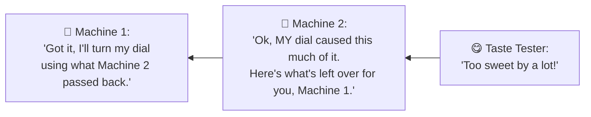
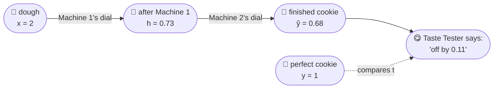
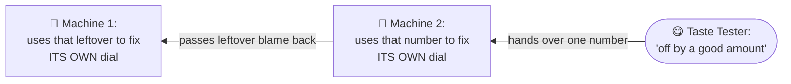

# Class 3 | Backpropagation: How a Network Figures Out Who to Blame 🍪

> **Next Up from Class 2:** *"The tiny-wiggle trick was cute, but imagine having 10 million weights. 💀 We obviously can't wiggle every number one-by-one. So how does the network calculate all those gradients efficiently?"*
>
> Grab a snack. We're about to explain it with cookies.

---

## 🍪 Meet the Cookie Factory

[#-meet-the-cookie-factory](#-meet-the-cookie-factory)

Imagine a tiny cookie factory with **two machines** in a row:

```
🌾 Dough  →  🔧 Machine 1  →  🔧 Machine 2  →  🍪 Finished Cookie  →  😋 Taste Tester
```

- **Machine 1** takes the raw dough and turns a dial to add some sweetness.
- **Machine 2** takes what Machine 1 made and turns its *own* dial to add more sweetness.
- At the end, a **Taste Tester** checks the cookie against the "perfect cookie" and says exactly how wrong it was.

Each machine's dial is a **weight**. The question we always want answered is:

> *"Which dial should turn, and by how much, to make the cookie taste better next time?"*

That question — for every single dial in the factory — is exactly what a neural network has to answer for every single weight, every time it trains. Real networks just have millions of tiny machines instead of two.

---

## 😤 Why Checking Each Dial One-By-One Is a Bad Idea

[#-why-checking-each-dial-one-by-one-is-a-bad-idea](#-why-checking-each-dial-one-by-one-is-a-bad-idea)

In Class 2, our plan was:

1. Turn Machine 1's dial a *tiny* bit
2. Re-bake the **entire batch** to see if the cookie got better or worse
3. Put the dial back, now turn Machine 2's dial a tiny bit
4. Re-bake the **entire batch** again
5. Repeat for every dial in the factory 😩

That works fine for 2 machines. But a real network has **millions** of dials. Re-baking the whole batch millions of times, just to adjust it *once*, would take forever.

**⭐ The wall we hit:** checking one dial costs one full re-bake. Millions of dials = millions of re-bakes = way too slow.

Backpropagation is the shortcut that gets us out of this.

---

## 💡 The Big "Aha": Blame Flows Backward, and Everyone Reuses It

[#-the-big-aha-blame-flows-backward-and-everyone-reuses-it](#-the-big-aha-blame-flows-backward-and-everyone-reuses-it)

Here's the trick, in one sentence:

> **Instead of re-baking the whole batch for every dial, the Taste Tester just tells Machine 2 how wrong the cookie was, and Machine 2 passes that same information back to Machine 1. Nobody re-bakes anything.**

Think of it like a game of telephone, except played *backwards* and *on purpose*:



Notice what did **not** happen: nobody baked a new batch of cookies. The Taste Tester's one verdict got reused by both machines, each one peeling off exactly its own share of the blame.

That's the entire idea behind backpropagation. Everything below is just this same idea, done with real numbers.

---

## 🏭 Let's Actually Run the Factory (the "forward pass")

[#-lets-actually-run-the-factory-the-forward-pass](#-lets-actually-run-the-factory-the-forward-pass)

Let's put real numbers on our tiny 2-machine factory:

- We feed in dough amount **x = 2**
- The perfect cookie sweetness should be **y = 1**
- Machine 1's dial is set to **w1 = 0.5** (and it adds a base amount **b1 = 0**)
- Machine 2's dial is set to **w2 = 1.0** (and it adds a base amount **b2 = 0**)

Running the dough through both machines, step by step:



That's it — dough goes in one end, a cookie comes out the other end, and the Taste Tester gives one single number saying how wrong it was. This part is identical to what we did in Class 2.

<details>
<summary>🔍 Click here for the exact math behind this step</summary>

Each machine does two things: mix in its dial (`w·input + b`), then "squash" the result to keep it between 0 and 1 using a function called **sigmoid**.

```
h_in = w1·x + b1   = 0.5 × 2 + 0   = 1.0
h    = sigmoid(h_in)                = 0.731

o_in = w2·h + b2   = 1.0 × 0.731 + 0 = 0.731
ŷ    = sigmoid(o_in)                 = 0.675

L    = (ŷ − y)²    = (0.675 − 1)²    = 0.1056
```
</details>

---

## 🔙 Now Let's Find Out Who's to Blame (the "backward pass")

[#-now-lets-find-out-whos-to-blame-the-backward-pass](#-now-lets-find-out-whos-to-blame-the-backward-pass)

This is the new part. Instead of re-baking anything, we start at the Taste Tester and walk **backward**, one machine at a time:



**What Machine 2 does:** it takes the one number the Taste Tester gave it, and reuses that *same number* for two things adjusting its own dial, **and** figuring out what to pass back to Machine 1. No re-baking.

**What Machine 1 does:** it takes the leftover number Machine 2 handed it, and uses that to adjust its own dial. It never needed to know anything about the Taste Tester directly the number that arrived already has everything it needs baked in (pun intended).

**⭐ The core insight:** one verdict from the Taste Tester turns into fixes for *every single dial* in the factory, just by passing one number backward and reusing it at each stop. In a factory with a million machines, this same relay race still only takes one backward walk.

<details>
<summary>🔍 Click here for the exact math behind this step</summary>

We use the **chain rule** — multiplying local slopes together as we walk backward.

**Stop 1 — at Machine 2 (the output):**

```
dL/dŷ    = 2(ŷ − y)      = 2(0.675 − 1)   = −0.650
dŷ/do_in = ŷ(1 − ŷ)      = 0.675 × 0.325   =  0.219
dL/do_in = dL/dŷ × dŷ/do_in                = −0.143   ← this is the number passed backward
```

That `dL/do_in` number gets reused **twice** — once for each of Machine 2's own settings:

```
dL/dw2 = dL/do_in × h   = −0.143 × 0.731  = −0.1042
dL/db2 = dL/do_in × 1                      = −0.1426
```

**Stop 2 — at Machine 1 (using the leftover blame):**

```
dL/dh    = dL/do_in × w2   = −0.143 × 1.0   = −0.143
dh/dh_in = h(1 − h)        = 0.731 × 0.269  =  0.197
dL/dh_in = dL/dh × dh/dh_in                 = −0.0280   ← this is Machine 1's leftover number
```

Reused **twice** again, for Machine 1's own settings:

```
dL/dw1 = dL/dh_in × x   = −0.028 × 2   = −0.0561
dL/db1 = dL/dh_in × 1                   = −0.0280
```

One forward pass, one backward pass, all four dial-adjustments done. Nothing was recomputed from scratch.
</details>

---

## 🖥️ Don't Just Trust Me — Here's the Code

[#-dont-just-trust-me-heres-the-code](#-dont-just-trust-me-heres-the-code)

`code/backprop_from_scratch.py` runs the exact factory above in plain Python — no shortcuts, no libraries — and then **checks its own homework** using the old re-baking (wiggle) trick from Class 2, just to prove the shortcut gives the same answer:

```
dL/dw2 = -0.10423   dL/db2 = -0.14257
dL/dw1 = -0.05606   dL/db1 = -0.02803

=== wiggle-trick check ===
w1: analytic = -0.05606   wiggled = -0.05606   ✅ match
b1: analytic = -0.02803   wiggled = -0.02803   ✅ match
w2: analytic = -0.10423   wiggled = -0.10423   ✅ match
b2: analytic = -0.14257   wiggled = -0.14257   ✅ match
```

Same answers, every time — but the shortcut got there without a single extra re-bake.

---

## 📌 Takeaways You Can Say Out Loud to Anyone

[#-takeaways-you-can-say-out-loud-to-anyone](#-takeaways-you-can-say-out-loud-to-anyone)

- A network is just a row of tiny machines, each with its own dial.
- To fix all the dials, you don't re-run the whole factory for each one — you send **one** verdict backward through the machines.
- Each machine reuses that one number to fix its own dial **and** to figure out what to pass to the machine behind it.
- This is why it works even with millions of dials: **one forward run + one backward run = every dial gets fixed**, instead of one run per dial.
- The old "re-bake and check" trick isn't useless — it's now just a way to *double-check* that the backward pass did its math correctly.

---

## 🔮 Next Up — Class 4

[#-next-up-class-4](#-next-up-class-4)

*"Every dial now knows exactly which way to turn and by how much. So... let's actually turn them! Nudge every single dial a tiny step in the right direction, taste the cookie again, and repeat that hundreds of times until the factory is baking perfect cookies on its own. Welcome to Gradient Descent, where the learning actually happens. 🎯"*
